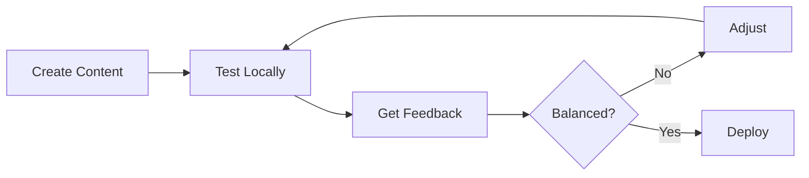

# Game Templates Guide

Welcome to the Telegram Game Engine Templates Guide! This document helps you choose and use the right template for your game.

## 📚 Table of Contents

1. [Available Templates](#available-templates)
2. [Quick Start](#quick-start)
3. [Template Comparison](#template-comparison)
4. [Customization Guide](#customization-guide)
5. [Best Practices](#best-practices)

---

## Available Templates

### 🎮 RPG Template

**Description:** Turn-based RPG with combat, inventory, quests, and locations.

**Features:**
- ⚔️ Combat system with mobs and abilities
- 🎒 Inventory and equipment system
- 📊 Player progression (XP and levels)
- 🏆 Achievements system
- 🗺️ Location/travel system
- 📋 Quest system

**Best for:** 
- Classic RPG games
- Roguelike adventures
- Dungeon crawlers
- Adventure games

**Estimated dev time:** 2-4 weeks for a complete game

---

### 🏭 Idle Clicker Template

**Description:** Incremental/idle game with automated resource generation.

**Features:**
- 🏗️ Building system with production
- ⬆️ Upgrade system
- 💰 Resource accumulation
- 📈 Exponential growth mechanics
- 🔄 Prestige system (optional)

**Best for:**
- Cookie Clicker-style games
- Incremental games
- Idle tycoons
- Resource management games

**Estimated dev time:** 1-2 weeks for a complete game

---

### 🃏 Card Game Template

**Description:** Deck-building card battle game with collectible cards.

**Features:**
- 🎴 Card collection system
- 📦 Deck building
- ⚔️ Turn-based card battles
- 💎 Mana system
- ✨ Card effects and keywords
- ⭐ Rarity tiers

**Best for:**
- Hearthstone-like games
- Slay the Spire-like games
- Trading card games
- Auto-battler games

**Estimated dev time:** 3-5 weeks for a complete game

---

## Quick Start

### Step 1: Choose Your Template

Pick the template that matches your game concept. Not sure? Start with **RPG** - it's the most versatile.

### Step 2: Copy Template

```bash
# Navigate to your projects directory
cd ~/projects

# Copy the template
cp -r path/to/tg_bot_engine/templates/rpg my_rpg_game

# Navigate to your new project
cd my_rpg_game
```

### Step 3: Setup Environment

```bash
# Create virtual environment
python -m venv venv

# Activate it
# Windows:
venv\Scripts\activate

# Linux/Mac:
source venv/bin/activate

# Install engine (development mode from parent project)
cd path/to/tg_bot_engine
pip install -e .

# Go back to your game
cd ~/projects/my_rpg_game

# Install game dependencies
pip install -r requirements.txt
```

### Step 4: Configure

```bash
# Copy environment template
cp .env.example .env

# Edit .env with your bot token
# Get token from @BotFather on Telegram
nano .env  # or use your favorite editor
```

Add your token:
```
TELEGRAM_BOT_TOKEN=1234567890:ABCdefGHIjklMNOpqrsTUVwxyz
```

### Step 5: Customize Content

Remove example files:
```bash
# For RPG
rm data/mobs/_example_*.json
rm data/items/_example_*.json

# For Idle Clicker
rm data/buildings/_example_*.json
rm data/upgrades/_example_*.json

# For Card Game
rm data/cards/_example_*.json
```

Create your own content (see template README.md for examples).

### Step 6: Run

```bash
python bot.py
```

Your bot should now be running! Test it on Telegram by messaging your bot.

---

## Template Comparison

| Feature | RPG | Idle Clicker | Card Game |
|---------|-----|--------------|-----------|
| **Complexity** | Medium | Low | High |
| **Dev Time** | 2-4 weeks | 1-2 weeks | 3-5 weeks |
| **Content Amount** | High | Medium | Very High |
| **Player Engagement** | Active | Passive | Active |
| **Retention** | Medium-High | Very High | Medium |
| **Monetization** | Good | Excellent | Good |
| **Scalability** | Good | Excellent | Medium |

### When to Use Each

**Use RPG Template if:**
- You want traditional game mechanics
- Players should actively play
- You have interesting story/lore
- Combat is core gameplay

**Use Idle Clicker Template if:**
- You want high retention
- Players can play casually
- Focus on progression systems
- Simple mechanics, complex math

**Use Card Game Template if:**
- You love card games
- Strategic depth is important
- You can create many cards
- Collection aspect appeals to you

---

## Customization Guide

### Modifying Schemas

All templates use JSON schemas for validation. You can modify them to add custom fields.

**Example: Adding "Faction" to RPG Mobs**

Edit `data/schemas/mob_schema.json`:
```json
{
  "properties": {
    ...
    "faction": {
      "type": "string",
      "description": "Mob faction",
      "enum": ["alliance", "horde", "neutral"],
      "default": "neutral"
    }
  }
}
```

Now all mobs can have a faction!

### Adding Custom Commands

Templates use the engine's command system. Add your own commands:

**Example: Custom Trade Command**

```python
# In your game directory, create: commands/trade.py

from engine.core import Command

class TradeCommand(Command):
    def __init__(self, player1_id, player2_id, item_id, gold):
        self.player1_id = player1_id
        self.player2_id = player2_id
        self.item_id = item_id
        self.gold = gold
    
    def get_entity_dependencies(self):
        return sorted([self.player1_id, self.player2_id])
    
    def execute(self, state):
        # Your trade logic here
        player1 = state.get_entity(self.player1_id)
        player2 = state.get_entity(self.player2_id)
        
        # Transfer item and gold
        # ...
        
        return {"success": True}
```

### Adding Custom Modules

Modules respond to game events. Great for achievements, analytics, etc.

**Example: Custom Analytics Module**

```python
# modules/analytics.py

from engine.core.events import event_bus

class AnalyticsModule:
    def __init__(self, state):
        self.state = state
        event_bus.subscribe("mob_killed", self.track_kill)
    
    def track_kill(self, event):
        # Log to your analytics service
        print(f"Player {event.data['player_id']} killed {event.data['mob_template']}")
```

### Extending Bot Handlers

Add custom Telegram commands:

```python
# In bot.py, add new handlers

@bot.message_handler(commands=['trade'])
async def trade_handler(message):
    # Parse trade parameters
    # Create TradeCommand
    # Execute and respond
    pass
```

---

## Best Practices

### Content Creation

1. **Start Small** - Create 3-5 items first, test, then expand
2. **Balance Early** - Test game balance with each addition
3. **Use Version Control** - Git is your friend for content too
4. **Document Content** - Add comments in JSON for future reference
5. **Playtest Often** - Get feedback from real players

### Development Workflow



1. Create content in JSON files
2. Test locally with your bot
3. Get feedback from testers
4. Adjust balance
5. Deploy to production

### Performance Tips

1. **Limit Active Entities** - Don't spawn thousands of mobs
2. **Use Caching** - Cache frequently accessed game data
3. **Optimize Queries** - Use entity dependencies correctly
4. **Monitor Metrics** - Watch command execution times
5. **Clean Up** - Delete old/unused entities regularly

### Security Considerations

1. **Validate All Input** - Never trust user input
2. **Rate Limit** - Prevent spam attacks
3. **Sanitize Data** - Escape special characters
4. **Check Permissions** - Verify player can perform action
5. **Log Suspicious Activity** - Monitor for cheating

---

## Common Patterns

### Pattern: Loot Tables

Used in RPG template, useful for any game with random rewards:

```json
{
  "loot_table": [
    {
      "item_id": "common_sword",
      "chance": 0.7,
      "min_quantity": 1,
      "max_quantity": 1
    },
    {
      "item_id": "rare_gem",
      "chance": 0.1,
      "min_quantity": 1,
      "max_quantity": 3
    }
  ]
}
```

### Pattern: Exponential Costs

Used in Idle Clicker, great for progression:

```python
def calculate_cost(base_cost, level, multiplier=1.15):
    return int(base_cost * (multiplier ** level))
```

### Pattern: Card Keywords

Used in Card Game, useful for modular effects:

```python
KEYWORDS = {
    "charge": lambda card: setattr(card, "can_attack_immediately", True),
    "taunt": lambda card: setattr(card, "must_be_attacked_first", True),
    # etc.
}
```

---

## Troubleshooting

### Common Issues

**Bot doesn't start**
- Check bot token is correct in `.env`
- Verify virtual environment is activated
- Ensure all dependencies are installed

**Data validation errors**
- Check JSON syntax (use JSONLint)
- Verify all required fields present
- Check field types match schema

**Import errors**
- Engine not installed: `pip install -e path/to/engine`
- Wrong Python version: Use Python 3.9+
- Missing dependencies: `pip install -r requirements.txt`

**Game balance issues**
- Too easy: Increase costs/decrease rewards
- Too hard: Decrease costs/increase rewards
- Test with fresh player account

---

## Next Steps

1. ✅ Choose your template
2. ✅ Copy and setup project
3. ✅ Create basic content (3-5 items)
4. ✅ Test bot locally
5. ✅ Add more content
6. ✅ Balance and polish
7. ✅ Deploy to production
8. ✅ Market your game!

---

## Resources

- [Engine API Reference](API_REFERENCE.md)
- [Quick Start Guide](QUICKSTART_GAME.md)
- [Usage Documentation](USAGE.md)
- [Main README](../README.md)

---

## Community & Support

- **Issues:** Report bugs on GitHub
- **Discussions:** Join our Discord/Telegram
- **Examples:** Check `/examples` directory
- **Contributing:** PRs welcome!

---

## License

Templates are part of the Telegram Game Engine project.
See main project for license information.

