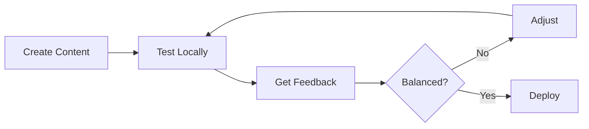

# Game Templates Guide

Welcome to the Telegram Game Engine Templates Guide! This document helps you choose and use the right template for your game.

## 📚 Table of Contents

1. [Available Templates](#available-templates)
2. [Quick Start](#quick-start)
3. [Template Comparison](#template-comparison)
4. [Customization Guide](#customization-guide)
5. [Best Practices](#best-practices)

---

## Available Templates

### 🎮 RPG Template

**Description:** Turn-based RPG with combat, inventory, quests, and locations.

**Features:**
- ⚔️ Combat system with mobs and abilities
- 🎒 Inventory and equipment system
- 📊 Player progression (XP and levels)
- 🏆 Achievements system
- 🗺️ Location/travel system
- 📋 Quest system

**Best for:** 
- Classic RPG games
- Roguelike adventures
- Dungeon crawlers
- Adventure games

**Estimated dev time:** 2-4 weeks for a complete game

---

### 🏭 Idle Clicker Template

**Description:** Incremental/idle game with automated resource generation.

**Features:**
- 🏗️ Building system with production
- ⬆️ Upgrade system
- 💰 Resource accumulation
- 📈 Exponential growth mechanics
- 🔄 Prestige system (optional)

**Best for:**
- Cookie Clicker-style games
- Incremental games
- Idle tycoons
- Resource management games

**Estimated dev time:** 1-2 weeks for a complete game

---

### 🃏 Card Game Template

**Description:** Deck-building card battle game with collectible cards.

**Features:**
- 🎴 Card collection system
- 📦 Deck building
- ⚔️ Turn-based card battles
- 💎 Mana system
- ✨ Card effects and keywords
- ⭐ Rarity tiers

**Best for:**
- Hearthstone-like games
- Slay the Spire-like games
- Trading card games
- Auto-battler games

**Estimated dev time:** 3-5 weeks for a complete game

---

## Quick Start

### Step 1: Choose Your Template

Pick the template that matches your game concept. Not sure? Start with **RPG** - it's the most versatile.

### Step 2: Copy Template

```bash
# Navigate to your projects directory
cd ~/projects

# Copy the template
cp -r path/to/tg_bot_engine/templates/rpg my_rpg_game

# Navigate to your new project
cd my_rpg_game
```

### Step 3: Setup Environment

```bash
# Create virtual environment
python -m venv venv

# Activate it
# Windows:
venv\Scripts\activate

# Linux/Mac:
source venv/bin/activate

# Install engine (development mode from parent project)
cd path/to/tg_bot_engine
pip install -e .

# Go back to your game
cd ~/projects/my_rpg_game

# Install game dependencies
pip install -r requirements.txt
```

### Step 4: Configure

```bash
# Copy environment template
cp .env.example .env

# Edit .env with your bot token
# Get token from @BotFather on Telegram
nano .env  # or use your favorite editor
```

Add your token:
```
TELEGRAM_BOT_TOKEN=1234567890:ABCdefGHIjklMNOpqrsTUVwxyz
```

### Step 5: Customize Content

Remove example files:
```bash
# For RPG
rm data/mobs/_example_*.json
rm data/items/_example_*.json

# For Idle Clicker
rm data/buildings/_example_*.json
rm data/upgrades/_example_*.json

# For Card Game
rm data/cards/_example_*.json
```

Create your own content (see template README.md for examples).

### Step 6: Run

```bash
python bot.py
```

Your bot should now be running! Test it on Telegram by messaging your bot.

---

## Template Comparison

| Feature | RPG | Idle Clicker | Card Game |
|---------|-----|--------------|-----------|
| **Complexity** | Medium | Low | High |
| **Dev Time** | 2-4 weeks | 1-2 weeks | 3-5 weeks |
| **Content Amount** | High | Medium | Very High |
| **Player Engagement** | Active | Passive | Active |
| **Retention** | Medium-High | Very High | Medium |
| **Monetization** | Good | Excellent | Good |
| **Scalability** | Good | Excellent | Medium |

### When to Use Each

**Use RPG Template if:**
- You want traditional game mechanics
- Players should actively play
- You have interesting story/lore
- Combat is core gameplay

**Use Idle Clicker Template if:**
- You want high retention
- Players can play casually
- Focus on progression systems
- Simple mechanics, complex math

**Use Card Game Template if:**
- You love card games
- Strategic depth is important
- You can create many cards
- Collection aspect appeals to you

---

## Customization Guide

### Modifying Schemas

All templates use JSON schemas for validation. You can modify them to add custom fields.

**Example: Adding "Faction" to RPG Mobs**

Edit `data/schemas/mob_schema.json`:
```json
{
  "properties": {
    ...
    "faction": {
      "type": "string",
      "description": "Mob faction",
      "enum": ["alliance", "horde", "neutral"],
      "default": "neutral"
    }
  }
}
```

Now all mobs can have a faction!

### Adding Custom Commands

Templates use the engine's command system. Add your own commands:

**Example: Custom Trade Command**

```python
# In your game directory, create: commands/trade.py

from engine.core import Command

class TradeCommand(Command):
    def __init__(self, player1_id, player2_id, item_id, gold):
        self.player1_id = player1_id
        self.player2_id = player2_id
        self.item_id = item_id
        self.gold = gold
    
    def get_entity_dependencies(self):
        return sorted([self.player1_id, self.player2_id])
    
    def execute(self, state):
        # Your trade logic here
        player1 = state.get_entity(self.player1_id)
        player2 = state.get_entity(self.player2_id)
        
        # Transfer item and gold
        # ...
        
        return {"success": True}
```

### Adding Custom Modules

Modules respond to game events. Great for achievements, analytics, etc.

**Example: Custom Analytics Module**

```python
# modules/analytics.py

from engine.core.events import event_bus

class AnalyticsModule:
    def __init__(self, state):
        self.state = state
        event_bus.subscribe("mob_killed", self.track_kill)
    
    def track_kill(self, event):
        # Log to your analytics service
        print(f"Player {event.data['player_id']} killed {event.data['mob_template']}")
```

### Extending Bot Handlers

Add custom Telegram commands:

```python
# In bot.py, add new handlers

@bot.message_handler(commands=['trade'])
async def trade_handler(message):
    # Parse trade parameters
    # Create TradeCommand
    # Execute and respond
    pass
```

---

## Best Practices

### Content Creation

1. **Start Small** - Create 3-5 items first, test, then expand
2. **Balance Early** - Test game balance with each addition
3. **Use Version Control** - Git is your friend for content too
4. **Document Content** - Add comments in JSON for future reference
5. **Playtest Often** - Get feedback from real players

### Development Workflow



1. Create content in JSON files
2. Test locally with your bot
3. Get feedback from testers
4. Adjust balance
5. Deploy to production

### Performance Tips

1. **Limit Active Entities** - Don't spawn thousands of mobs
2. **Use Caching** - Cache frequently accessed game data
3. **Optimize Queries** - Use entity dependencies correctly
4. **Monitor Metrics** - Watch command execution times
5. **Clean Up** - Delete old/unused entities regularly

### Security Considerations

1. **Validate All Input** - Never trust user input
2. **Rate Limit** - Prevent spam attacks
3. **Sanitize Data** - Escape special characters
4. **Check Permissions** - Verify player can perform action
5. **Log Suspicious Activity** - Monitor for cheating

---

## Common Patterns

### Pattern 1: Loot Tables (RPG, любые игры с дропом)

**Использование:**
```python
from engine.core import utils

# В команде после убийства моба
mob_template = get_data_loader().get_template("mob", "goblin")
dropped_items = utils.roll_loot_table(mob_template["loot_table"])

for item_id in dropped_items:
    # Добавить item_id в инвентарь игрока
    pass
```

**JSON структура:**
```json
{
  "loot_table": [
    {
      "item_id": "common_sword",
      "chance": 0.7,
      "min_quantity": 1,
      "max_quantity": 1
    },
    {
      "item_id": "rare_gem",
      "chance": 0.1,
      "min_quantity": 1,
      "max_quantity": 3
    }
  ]
}
```

### Pattern 2: Gacha System (CCG, коллекционные игры)

**Embedded Collection подход:**
```python
# Хранить коллекцию в профиле игрока
player = {
    "_type": "player",
    "gold": 1000,
    "collection": {
        "card_001": {"quantity": 3, "level": 5},
        "card_002": {"quantity": 1, "level": 1}
    }
}

# Команда для gacha pull
class GachaOpenPackCommand(Command):
    def execute(self, state):
        all_cards = get_data_loader().get_all("card")
        rarity_weights = {
            "common": 70.0,
            "rare": 25.0,
            "epic": 4.0,
            "legendary": 1.0
        }
        
        pulled_card = utils.gacha_pull(all_cards, rarity_weights)
        
        player = state.get_entity(self.player_id)
        card_id = pulled_card["id"]
        
        if card_id not in player["collection"]:
            player["collection"][card_id] = {"quantity": 1, "level": 1}
        else:
            player["collection"][card_id]["quantity"] += 1
        
        state.set_entity(self.player_id, player)
        return {"card": pulled_card}
```

### Pattern 3: Turn-Based Combat (RPG)

**Battle Entity подход:**
```python
# Создать сущность боя
class StartBattleCommand(Command):
    def execute(self, state):
        battle_id = f"battle_{uuid.uuid4()}"
        battle = {
            "_type": "battle",
            "player_id": self.player_id,
            "mob_id": self.mob_id,
            "turn": 1,
            "status": "player_turn",
            "active_effects": []
        }
        state.set_entity(battle_id, battle)
        return {"battle_id": battle_id}

# Выполнить действие в бою
class BattleActionCommand(Command):
    def __init__(self, battle_id, action):
        self.battle_id = battle_id
        self.action = action  # "attack", "defend", "skill"
    
    def get_entity_dependencies(self):
        return [self.battle_id]
    
    def execute(self, state):
        battle = state.get_entity(self.battle_id)
        
        if battle["status"] != "player_turn":
            raise ValueError("Not player's turn!")
        
        player = state.get_entity(battle["player_id"])
        mob = state.get_entity(battle["mob_id"])
        
        # Выполнить действие
        if self.action == "attack":
            damage = player["attack"]
            mob["current_hp"] -= damage
        
        # Применить эффекты
        for effect in battle["active_effects"]:
            if effect["effect"] == "poison":
                mob["current_hp"] -= effect["damage"]
                effect["duration"] -= 1
        
        # Удалить истёкшие эффекты
        battle["active_effects"] = [
            e for e in battle["active_effects"] 
            if e["duration"] > 0
        ]
        
        # Проверить конец боя
        if mob["current_hp"] <= 0:
            battle["status"] = "victory"
            state.delete_entity(self.battle_id)
            return {"result": "victory", "gold": mob["gold_reward"]}
        
        # Переключить ход
        battle["status"] = "mob_turn"
        battle["turn"] += 1
        state.set_entity(self.battle_id, battle)
        
        return {"damage": damage, "mob_hp": mob["current_hp"]}
```

### Pattern 4: Offline Progress (Idle Clicker)

**Calculation при входе:**
```python
from engine.core import utils
import time

class CalculateOfflineProgressCommand(Command):
    def execute(self, state):
        player = state.get_entity(self.player_id)
        
        last_login = player.get("last_login", time.time())
        current_time = time.time()
        
        # Рассчитать производство
        buildings = player.get("buildings", {})
        total_production = 0
        
        for building_id, building_data in buildings.items():
            level = building_data["level"]
            template = get_data_loader().get_template("building", building_id)
            
            base_prod = template["production_rate"]
            multiplier = template["production_multiplier"]
            production = utils.calculate_exponential_production(
                base_prod, level, multiplier
            )
            total_production += production
        
        # Рассчитать офлайн прогресс
        result = utils.calculate_offline_progress(
            last_login, current_time, 
            total_production,
            max_offline_hours=8
        )
        
        # Начислить ресурсы
        player["gold"] = player.get("gold", 0) + result["earned"]
        player["last_login"] = current_time
        
        state.set_entity(self.player_id, player)
        
        return result
```

### Pattern 5: Exponential Costs (Idle/Clicker)

**Использование:**
```python
from engine.core import utils

# В команде покупки здания
class UpgradeBuildingCommand(Command):
    def execute(self, state):
        player = state.get_entity(self.player_id)
        building = player["buildings"][self.building_id]
        template = get_data_loader().get_template("building", self.building_id)
        
        current_level = building["level"]
        cost = utils.calculate_exponential_cost(
            template["base_cost"], 
            current_level,
            template.get("cost_multiplier", 1.15)
        )
        
        if player["gold"] < cost:
            raise ValueError("Not enough gold")
        
        player["gold"] -= cost
        building["level"] += 1
        
        state.set_entity(self.player_id, player)
        return {"new_level": building["level"], "cost": cost}
```

### Pattern 6: Query Entities (Любые игры)

**Использование новых методов GameState:**
```python
# Получить всех игроков
players = state.get_entities_by_type("player")

# Получить всех мобов в локации
mobs_in_location = state.get_entities_by_filter(
    lambda e: e.get("_type") == "mob" and e.get("location") == "forest"
)

# Получить топ игроков по золоту
all_players = state.get_entities_by_type("player")
top_players = sorted(all_players, key=lambda p: p.get("gold", 0), reverse=True)[:10]
```

### Pattern 7: Stat Modifiers - Buffs & Debuffs (RPG)

**Использование системы модификаторов:**
```python
from engine.core.modifiers import (
    add_modifier, 
    StatCalculator, 
    remove_modifiers_by_source
)

# Команда для применения баффа
class ApplyBuffCommand(Command):
    def __init__(self, player_id, buff_type, duration):
        self.player_id = player_id
        self.buff_type = buff_type
        self.duration = duration
    
    def execute(self, state):
        player = state.get_entity(self.player_id)
        
        # Добавить бафф (+50% атаки на 3 хода)
        add_modifier(
            player, 
            stat="attack", 
            type="percent", 
            value=0.5, 
            source=f"buff_{self.buff_type}",
            duration=self.duration
        )
        
        state.set_entity(self.player_id, player)
        return {"buff_applied": self.buff_type}

# В боевой команде использовать финальные статы
class EnhancedAttackCommand(Command):
    def execute(self, state):
        player = state.get_entity(self.player_id)
        mob = state.get_entity(self.mob_id)
        
        # Рассчитать финальные статы с модификаторами
        player_stats = StatCalculator.get_all_stats(player)
        
        damage = int(player_stats["attack"])
        mob["hp"] -= damage
        
        # В конце хода обновить длительности
        expired = StatCalculator.update_modifier_durations(player)
        
        state.set_entity(self.player_id, player)
        state.set_entity(self.mob_id, mob)
        
        return {
            "damage": damage,
            "expired_buffs": [m["source"] for m in expired]
        }
```

**Структура сущности с модификаторами:**
```json
{
  "_type": "player",
  "_id": "player_1",
  "base_attack": 10,
  "base_defense": 5,
  "base_hp": 100,
  "modifiers": [
    {
      "stat": "attack",
      "type": "flat",
      "value": 5,
      "source": "item_sword",
      "duration": -1
    },
    {
      "stat": "attack",
      "type": "percent",
      "value": 0.3,
      "source": "buff_strength",
      "duration": 3
    }
  ]
}
```

**Применение модификаторов:**
- FLAT: +5 атаки (additive)
- PERCENT: +30% атаки (multiplicative, складываются между собой)
- MULTIPLY: x2 атаки (полностью multiplicative)

Порядок: `(base + sum(FLAT)) * (1 + sum(PERCENT)) * product(MULTIPLY)`

### Pattern 8: Bonus Calculator - Multipliers (Idle/Clicker)

**Использование системы бонусов:**
```python
from engine.core.bonuses import (
    BonusCalculator,
    load_bonuses_from_entity,
    save_bonuses_to_entity
)

# Команда для разблокировки ачивки с бонусом
class UnlockAchievementCommand(Command):
    def execute(self, state):
        player = state.get_entity(self.player_id)
        
        # Загрузить калькулятор
        calc = load_bonuses_from_entity(player)
        
        # Добавить бонус от ачивки
        calc.add_bonus("production", "percent", 0.05, f"ach_{self.achievement_id}")
        
        # Сохранить обратно
        save_bonuses_to_entity(player, calc)
        state.set_entity(self.player_id, player)
        
        return {"achievement_unlocked": self.achievement_id}

# Команда для сбора ресурсов с учётом бонусов
class CollectResourcesCommand(Command):
    def execute(self, state):
        player = state.get_entity(self.player_id)
        
        # Загрузить калькулятор
        calc = load_bonuses_from_entity(player)
        
        # Базовое производство
        base_production = 100
        
        # Финальное производство с учётом всех бонусов
        final_production = calc.calculate("production", base_production)
        
        player["gold"] = player.get("gold", 0) + final_production
        state.set_entity(self.player_id, player)
        
        return {"gold_earned": final_production}

# Установить лимиты (caps)
calc = BonusCalculator()
calc.add_cap("offline_hours", 8)  # Максимум 8 часов офлайна
calc.add_cap("max_gold", 1000000)  # Лимит золота

# Рассчитать с учётом лимита
offline_time = calc.calculate("offline_hours", 24)  # Вернёт 8
```

**Пример для idle игры с множителями:**
```python
# Инициализация игрока с бонусами
player = {
    "_type": "player",
    "gold": 0,
    "bonuses": {
        "bonuses": {
            "production": [
                {"type": "percent", "value": 0.10, "source": "upgrade_1"},
                {"type": "percent", "value": 0.05, "source": "ach_novice"},
                {"type": "multiply", "value": 2.0, "source": "item_lucky_charm"}
            ],
            "offline_hours": [
                {"type": "flat", "value": 2, "source": "ach_night_owl"}
            ]
        },
        "caps": {
            "offline_hours": 8
        }
    }
}

# Загрузить и использовать
calc = load_bonuses_from_entity(player)

# Базовое производство: 100/час
# Бонусы: +10% (upgrade), +5% (ачивка), x2 (предмет)
# Итого: 100 * 1.15 * 2.0 = 230/час

production = calc.calculate("production", 100)
# 230.0

# Офлайн прогресс
offline_hours = calc.calculate("offline_hours", 10)  # Вернёт 8 (cap)
gold_earned = production * offline_hours
```

### Pattern 9: Bulk Loading - Collections (CCG/RPG)

**Проблема:** Загрузка коллекций медленная (30 карт = 30 SQL запросов)

**Решение:** Использовать bulk loading (v0.5.6+)

```python
from engine import PersistentGameState, SQLiteRepository

# Команда для загрузки колоды игрока
class LoadPlayerDeckCommand(Command):
    def __init__(self, player_id):
        self.player_id = player_id
    
    def execute(self, state):
        player = state.get_entity(self.player_id)
        
        # ❌ МЕДЛЕННО: 30 отдельных запросов
        # cards = []
        # for card_id in player["deck_card_ids"]:
        #     cards.append(state.get_entity(card_id))
        
        # ✅ БЫСТРО: 1 SQL запрос (~25x быстрее!)
        deck_ids = player.get("deck_card_ids", [])
        cards = state.get_entities_bulk(deck_ids)
        
        # Рассчитать total power
        total_power = sum(
            c.get("attack", 0) + c.get("defense", 0)
            for c in cards.values()
        )
        
        return {
            "cards": list(cards.values()),
            "total_power": total_power
        }
```

**Performance comparison:**

| Операция | Обычный способ | Bulk Loading | Улучшение |
|----------|----------------|--------------|-----------|
| 30 карт | 30 queries, ~500ms | 1 query, ~20ms | **25x** |
| 100 предметов | 100 queries, ~1.5s | 1 query, ~50ms | **30x** |

**Когда использовать:**
- Загрузка колод в CCG играх
- Загрузка инвентаря в RPG
- Загрузка коллекций карт/предметов
- Любые операции с множеством сущностей

### Pattern 10: Media Albums - Gacha Results (CCG/Gacha)

**Проблема:** Gacha x10 = 10 отдельных сообщений (спам)

**Решение:** Использовать media albums (v0.5.6+)

```python
from engine.adapters.telegram import ResponseBuilder, get_media_library
from engine.services import GachaService

class GachaPull10Command(Command):
    def __init__(self, player_id):
        self.player_id = player_id
    
    def execute(self, state):
        player = state.get_entity(self.player_id)
        
        # Выполнить 10-крутку
        gacha_service = GachaService()
        card_pool = get_data_loader().get_all("card")
        
        results = gacha_service.multi_pull(
            player,
            card_pool,
            owner_id=self.player_id
        )
        
        # Сохранить все карты
        cards = []
        for result in results:
            state.set_entity(result.card["_id"], result.card)
            cards.append(result.card)
        
        # Обновить pity counter
        player["pity_counter"] = results[-1].new_pity_counter
        state.set_entity(self.player_id, player)
        
        return {"cards": cards}

# В обработчике Telegram бота:
async def handle_gacha_pull_10(message: Message):
    # Выполнить команду
    result = await executor.execute(GachaPull10Command(player_id))
    
    if not result.success:
        await message.answer(f"❌ Ошибка: {result.error}")
        return
    
    cards = result.data["cards"]
    builder = ResponseBuilder()
    
    # ❌ ПЛОХО: 10 отдельных сообщений
    # for card in cards:
    #     await message.answer_photo(
    #         FSInputFile(card["image"]),
    #         caption=f"{card['rarity']} - {card['name']}"
    #     )
    
    # ✅ ХОРОШО: 1 красивый альбом
    album = builder.build_media_album(
        cards,
        media_library=get_media_library(),
        caption_formatter=lambda c, i: f"{c['rarity']} ⭐ {c['name']}"
    )
    
    # Отправить альбом
    await message.answer_media_group(album)
    
    # + текстовая сводка
    summary = builder.build_gacha_result_text(cards)
    await message.answer(summary)
    # 🎰 Результаты гачи (10 круток)
    # 
    # ⚪ C: 7 шт.
    # 🔵 B: 2 шт.
    # 🟣 A: 1 шт.
```

**Преимущества:**
- ✅ Красивый UX (альбом вместо спама)
- ✅ Интеграция с MediaLibrary (кэширование file_id)
- ✅ Поддержка до 10 изображений (лимит Telegram)
- ✅ Custom caption formatter

**Когда использовать:**
- Gacha/Lootbox результаты (x10)
- Отображение коллекций карт
- Награды с множеством предметов
- Любые множественные медиа-результаты

---

## Troubleshooting

### Common Issues

**Bot doesn't start**
- Check bot token is correct in `.env`
- Verify virtual environment is activated
- Ensure all dependencies are installed

**Data validation errors**
- Check JSON syntax (use JSONLint)
- Verify all required fields present
- Check field types match schema

**Import errors**
- Engine not installed: `pip install -e path/to/engine`
- Wrong Python version: Use Python 3.9+
- Missing dependencies: `pip install -r requirements.txt`

**Game balance issues**
- Too easy: Increase costs/decrease rewards
- Too hard: Decrease costs/increase rewards
- Test with fresh player account

---

## Next Steps

1. ✅ Choose your template
2. ✅ Copy and setup project
3. ✅ Create basic content (3-5 items)
4. ✅ Test bot locally
5. ✅ Add more content
6. ✅ Balance and polish
7. ✅ Deploy to production
8. ✅ Market your game!

---

## Resources

- [Engine API Reference](API_REFERENCE.md)
- [Quick Start Guide](QUICKSTART_GAME.md)
- [Usage Documentation](USAGE.md)
- [Main README](../README.md)

---

## Community & Support

- **Issues:** Report bugs on GitHub
- **Discussions:** Join our Discord/Telegram
- **Examples:** Check `/examples` directory
- **Contributing:** PRs welcome!

---

## License

Templates are part of the Telegram Game Engine project.
See main project for license information.

